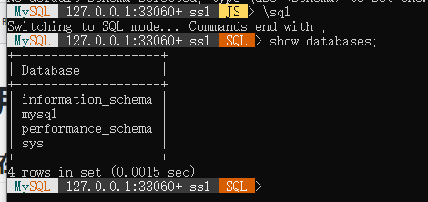

# MySQL使用记录

## MySQL Shell在win10上使用

MySQL的下载地址:[MySQL Shell](https://dev.mysql.com/downloads/shell/)，下载后解压缩将bin文件目录添加到环境变量中。

打开cmd终端，在终端上输入`mysqlsh`，进入MySQL Shell，操作如下所示：

在上图中出现的shell中可以输入`\help`，输出帮助信息。

使用`\connect root@127.0.0.1`，然后输入密码就可以连接到MySQL服务。如下图所示：

紧接着输入`\sql`进入SQL命令模式，在这个模式输入SQL Command，如下图所示：

