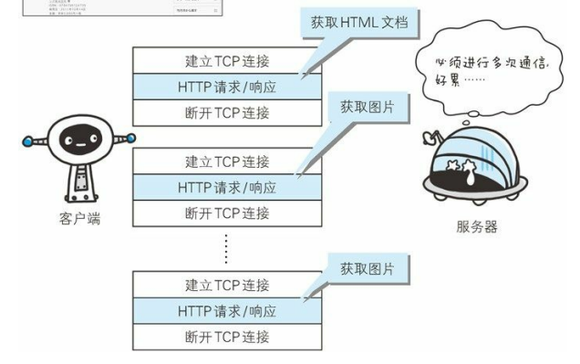

# HTTP学习

## TCP/IP协议族

TCP/IP协议族按层次分可以分为4层：应用层、传输层、网络层和数据链路层。各层的功能如下：

* 应用层：应用层决定了向用户提供应用服务时通信的活动。在应用层有一些比较常用的协议，如文件传输协议（FTP）、域名系统（DNS）、还有超文本传输协议（HTTP）等
* 传输层：传输层在应用层的下层，提供处于网络连接中的两台计算机之间的数据传输。在这层有两个性质不同的协议：TCP（Transmission Control Protocol，传输控制协议）和 UDP（User Data Protocol，用户数据报协议）
* 网络层：该层决定了数据包的传输路径以及路由选址问题
* 数据链路层：用来处理连接网络的硬件部分。硬件上的范畴均在 链路层的作用范围之内。

TCP/IP通信信息流传输如下：

KRUYR.png)

## HTTP协议中的方法

在HTTP协议中有许多的方法：GET、POST、PUT、DELET、HEAD、OPTIONS、TRACE、CONNECT等。下面分别介绍他们：

#### 1. GET方法

GET方法用来请求访问服务器中指定的资源。指定的资源经服务器端解析后返回响应内容。如果请求的是文本则返回文本，如果是请求像CGI（Common Gateway Interface，通用网关接口）这样的程序就返回经过执行后的输出结果。

使用GET方法的请求例子如下：

```
GET /index.html HTTP/1.1
Host:www.hacker.jp
```

服务器会返回`index.htm`的页面资源。

#### 2. POST方法

POST方法用来传输实体的主体。使用POST方法的请求例子如下：

```
POST /submit.cgi HTTP/1.1
Host:www.hacker.jp
Content—Length:1560(1560字节的数据)
```

服务器会返回`submit.cgi`接收数据的处理结果.

#### 3. PUT方法

PUT方法是用来传输文件的。在请求报文的主体中包含文件的内容，然后保存在URI指定的位置。但是PUT方法没有验证机制，存在安全问题，因此一般的web网站不使用该方法。

使用PUT方法的请求例子如下：

```
PUT /example.html HTTP/1.1
Host:www.hacker.jp
Content-Type:text/html
Content-Length:1560
```
#### 4. HEAD方法

HEAD方法和GET方法一样，只是不返回报文的主体部分，而是放回报文的首部。

使用HEAD方法的请求例子如下：

```
HEAD /index.html HTTP/1.1
Host:www.hacker.jp
```
服务器返回`index.html`有关的响应首部。

#### 5. DELET方法

DELET方法是用来删除文件的，与PUT方法相反。DELET方法按请求URI删除指定的资源。和PUT方法类似，DELET方法也是不带安全验证的，所以一般的web网站也不提供该方法。

使用DELET方法的请求例子如下：

```
DELET /example.html HTTP/1.1
Host:www.hacker.jp
```

#### 6. OPTIONS方法

OPTIONS方法用来查询针对请求URI指定的资源支持的方法。

使用OPTIONS方法的请求例子如下：

 ```
 OPTIONS * HTTP/1.1
 Host:www.hacker.jp
 ```
 
 服务器返回支持的方法。
 
 #### TRACE方法
 
 TARCE方法追踪路径。TRACE方法是让web服务器端将之前的请求通信环回给客户端的方法。
 
 #### CONNECT方法
 
 CONNECT方法要求在与代理服务器通信时建立隧道，实现用隧道协议进行TCP通信。主要使用SSL（Secure Socket Layer，安全套接层）和TLS（Transport Layer Security，传输层安全）协议吧通信内容加密后经网络隧道传播。CONNECT方法的格式如下所示：
 
 ```
 CONNECT 代理服务器名：端口号 HTTP版本
 ```
 
 使用CONNECT方法的请求例子如下：
 
 ```
 CONNECT proxy.hacker.jp:8080 HTTP/1.1
 Host:proxy.hacker.jp
 ```
 
 ## 持久连接
 
 HTTP协议的初始版本中，每进行一次HTTP通信就要断开一次TCP连接。现在的网页中会包含其他的许多资源，如果每次请求都要断开一次TCP连接，会增加通信量的开销。如下图中所表达的意思：
 
 

为了解决上面TCP连接问题，HTTP1.1想出持久化连接（HTTP Persistent Connection，也称HTTP kepp-alive或HTTP  connection reuse）的方法。该方法的特点是只要任意一端没有明确提出断开连接，则保持TCP连接状态。

## Cookie技术

由于HTTP协议是无状态的协议，所以服务器不会记录上一次的请求和响应。为了解决这个问题，引入了Cookit技术。Cookie技术通过在请求和响应报文中写入Cookie信息来控制客户端的状态。

Cookie 会根据从服务器端发送的响应报文内的一个叫做 Set-Cookie的 首部字段信息，通知客户端保存 Cookie。当下次客户端再往该服务器 发送请求时，客户端会自动在请求报文中加入Cookie值后发送出去。

服务器端发现客户端发送过来的 Cookie后，会去检查究竟是从哪一 个客户端发来的连接请求，然后对比服务器上的记录，最后得到之前的状态信息。

## HTTP报文

用于HTTP协议交互的信息被称为HTTP报文。请求端（客户端）的HTTP 报文叫做请求报文，响应端（服务器端）的叫做响应报文。HTTP报文本身是由多行（用 CR+LF 作换行符）数据构成的字符串文本。

HTTP报文大致可分为报文首部和报文主体两块。如下图所示：

[报文格式](./picture/报文格式.jpg)
